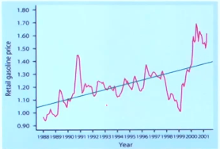

# 러닝패킷 : 통계의 기초 요약

## 1. 자료의 형태와 요약 1

### 자료의 형태는 2가지

> 1) categorical(범주형): 명목/ 순서
>
> * 명목(Nominal) 변수: 순서 없는 범주를 가지는 변수
>
> 예) 성별(남, 여), 지역(서울, 부산, 광주 ...)
>
> * 순서(Ordinal)변수: 순서가 있는 범주를 가지는 변수
>
> 예) 자동차 크기(소형, 중형, 대형), 계층(상, 중, 하)
>
> 
>
> 2) quantitative(양적): 연속/ 이산
>
> * 연속(Continuous) 변수: 무수히 많은 다른 값을 가짐
>
> 예) 키, 몸무게 , 온도
>
> * 이산(Discrete)변수 : 몇 개의 다른 값만 가짐
>
> 예) 고장 횟수, 가족 구성원의 수

### 범주형 자료

> 1) 도수분포표(Frequency table)
>
> 예) 혈액형의 분포가 어떻게 되어있는지, 질병에 의한 사망원인
>
> 
>
> 2) 막대 그래프
>
> - 각 범주가 하나의 막대로 표현됨
>
> 
>
> 3) 파이형 (원형)
>
> * 각 범주는 파이의 한 Slice로 표현됨
> * 보통 % 를 사용하여 모두 더해서 1이 되도록 함
>

### 양적 자료

> 1) Graphical 요약
>
> - Dotplot, stemplot, Histogram, Boxplot, Line graph 등
>
>   Dotplot의 예) 0에 3개의 데이터 2에 7개의 데이터 등
>
>   
>
> - 전체적인 분포의 패턴과 그 패턴으로부터 벗어난 극단척 관측치들을 봄
>
> 
>
> 2) 수치적 요약
>
> - 대표값(Center of distribution)
>
>   : 산술평균, 중앙값, 최빈값(범주형도 가능)
>
> -  산포도( Spread of distribution)
>
>   : 범위, 사분위범위 (IQR), 표준편차 등

### 줄기-잎 그림(Stemplot)

> - 쉽고 빠르게 그릴 수 있으며 정보의 손실이 없음
>
> - 모든 값이 양수면서 데이터 양이 적을 경우 좋다.
>
> - 두 개의 연관된 분포를 비교하고 싶을 때, 같은 줄기를 공유하는 Back-to-back stemplot이 유용
>
>   예) 이슬람국가의 글을 읽을 수 있는 사람의 분포와 줄기-잎 표현
>
>   첫째 줄이 십의 자리 둘째 줄이 일의 자리인 식이다.
>
>   
>
>   

### 히스토그램(Histogram) - 양적 자료 요약에 가장 많이 사용됨

> - 자료의 범위(range)를 몇 개의 구간(class)으로 나누고 각 구간에 들어가는 관측치의 빈도(frequency) 또는
>
>   상대빈도( relative frequency)만을 나타내는 그림
>
> - Dataset이 큰 경우 좋음
>
> - 히스토그램의 각 막대는 그 class의 빈도에 비례
>
> - 그리는 방법
>
>   - 자료의 범위를 구간(class)으로 나눔(5 - 10 개 정도가 적당)
>   - 각 class에 들어가는 관측치의 개수(frequency) 를 계산
>   - 각 class별로 빈도 또는 상대빈도를 표현
>
>   

### Line graph(time plot)

>- 시계열 자료인 경우 x축을 시간으로 한 time plot에서 trend와 seasonal variation 등을 찾을 수 있음
>- 파란색 선이 trend
>- 빨간색 선이 seasonal variation
>
>

### 연습문제

먼저 정리 되어 있지 않은 데이터를 오름차순으로 정리하자.

| 50   | 54   | 55   | 57   | 60   | 64   | 65   | 66   |
| ---- | ---- | ---- | ---- | ---- | ---- | ---- | ---- |
| 70   | 72   | 75   | 78   | 79   | 80   | 81   | 82   |
| 84   | 85   | 87   | 90   | 90   | 90   | 92   | 95   |

1. 도수 분포표

| 구분    | 도수 |
| ------- | ---- |
| 60 이하 | 5    |
| 61 ~ 70 | 4    |
| 71 ~ 80 | 5    |
| 81 ~ 90 | 8    |
| 91~ 100 | 2    |
| 합계    | 24   |

2. 히스토그램

3. 줄기-잎 그림

