## 2. 자료의 형태와 요약2

### 대표값

- 산술평균(mean)

  - 계산이 쉽고 수학적으로 다루기 쉬움
  - 모든 관측치를 사용하므로 **특이값에 영향을 많이 받음**

- 중앙값(median)

  - 관측한 자료를 순서대로 배열하여 가장 중앙에 있는 값
  - 순위를 사용해 중앙에 있는 값만 사용하므로 **특이값에 영향을 받지 않음**
  - 중앙값의 계산

  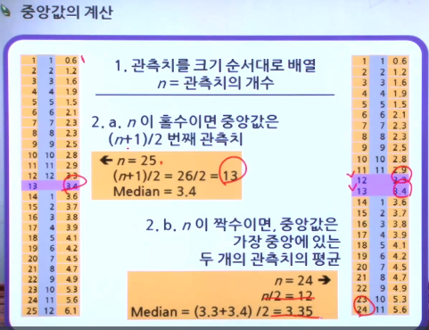

- 최빈값(mode)

  - 관측치 가운데 가장 여러 번 나타난 값
  - 여러 개 존재하거나 존재하지 않을 수 있고 중심을 잘 대변하지 못하는 경우가 많음
  - 이산 변수에 주로 사용하고, 범주형 자료에도 사용가능

- **분포가 한쪽으로 치우쳐있는 경우나 특이값들이 있는 경우 중앙값**

  **그렇지 않은 경우는 대부분 산술평균이 적합하다.**

### 산포도(spread)

- 범위(range)

  - 최대값 - 최소값
  - 간단하지만 특이값에 큰 영향을 받음

- 4분위 범위(IQR, interquartile range)

  - 특이값에 영향 받지 않음

  - 백분위수 (percentile, quantile)

    - p백분위수란 p%의 관측치는 이 값 아래에 있고 나머지는 이 값보다 위에 있게 되는 값을 말함

    - 중앙값: 50 백분위수

    - Q1 = 25 백분위수 = 제 1사분위수 (first quartile)

    - Q3 = 75 백분위수 = 제 3사분위수 (third quartile)

    - IQR = Q3 - Q1

    - 다섯 숫자 요약(Five-number summary)

      : min Q1 median Q3 max

- 표준편차

  - 가장 많이 사용되며 통계적 추론에 유용
  - 산술평균처럼 특이값에 영향을 받음

  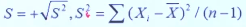

### 상자그림(Boxplot)

- 다섯 숫자 요약의 graphical result

- 상자는 중앙 50%의 자료를 표시

- 여러 개의 분포를 한 눈에 비교할 때 유용함

- 그리는 방법:

  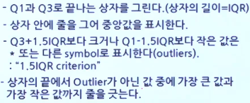

- Boxplot의 예시

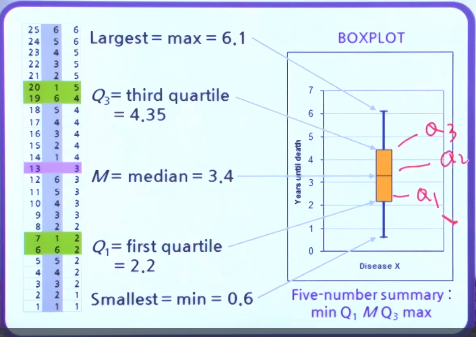

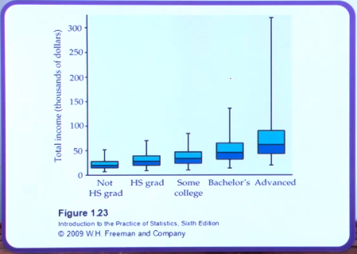

​							최종학력이 높을 수록 벌어들이는 수입의 박스플롯으로 증가하는 것을 알 수 있다.

​							박스플롯을 이용하면 비교해서 한눈에 보기 수월하다.

- Boxplot의 분포형태와 상자그림

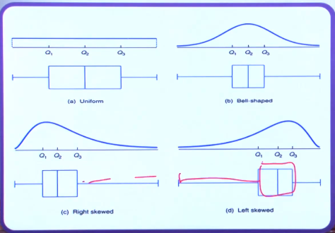

## 연습문제: 자료의 형태와 요약2

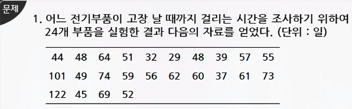

1) 이 표본에서 고장 날 때까지 걸린 시간의 평균을 구하라.

평균 = 전체데이터 / 전체데이터 개수 = 57.79

2) 고장 날 때까지 걸린 시간의 표준편차를 구하라.

표준편차의 공식을 적용하여 20.51이 나옵니다.

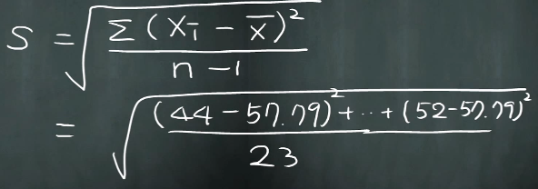

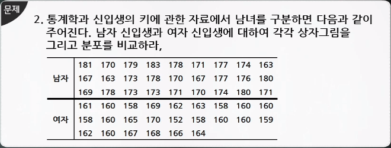

1) 남자

- 상자 그림을 그리기 위해 먼저 관측 값을 작은 순서대로 배열한다.

|      | 163  | 163  | 167  | 167  | 169  | 170  | 170  | 170  | 171  |
| ---- | ---- | ---- | ---- | ---- | ---- | ---- | ---- | ---- | ---- |
| 남자 | 171  | 171  | 173  | 173  | 173  | 174  | 174  | 176  | 177  |
|      | 177  | 178  | 178  | 178  | 179  | 180  | 180  | 181  | 183  |

- 관측값의 개수: 27
- 최소 값: 163
- 최대 값: 183
- 중앙값: 관측값의 개수가 홀수개이므로 (27+1)/ 2 이므로 14번째인 173이 됩니다.

- Q1 : 전체데이터의 4분의 1 번째이므로 (27+1) * 0.25 =  7번째인 170이 됩니다.
- Q3 : 전체데이터의 4분의 3번째이므로 (27+1) * 0.75 =  21번째인 178이 됩니다.
- IQR: Q3- Q1 이므로 8이 됩니다.
- 아래 경계 값: Q1 - 1.5IQR = 170 - 1.5 * 8 = 158 이 됩니다.
- 위의 경계 값: Q3 + 1.5IQR = 178 + 1.5 * 8 = 190 이 됩니다.
- 전체 데이터가 158과 190 사이에 있으므로 이상점은 없고 양 끝의 데이터 값은 163과 183이 됩니다.
- 남자 Boxplot 그림

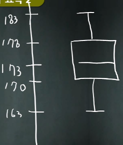

2) 여자 또한 같은 방법으로 구합니다.

- 그래서 최종적으로 구한 남자와 여자의 Boxplot 입니다.

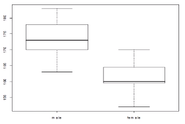

두 상자그림을 비교해보면 남자의 키가 여자의 키보다 평균적으로 약 10cm정도 크다고 볼 수 있고,

사분위 수 범위는 남자의 경우가 여자의 경우보다 크지만 자료 전체의 경우는 여자와 남자 거의 같다고 볼 수 있습니다.

또한 남자의 분포는 고르게 분포했지만 여자의 분포는 다소 낮게 치우쳐져 있는 것을 알 수 있습니다.