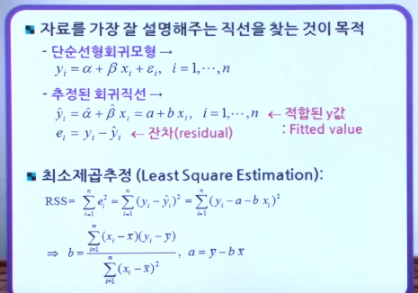
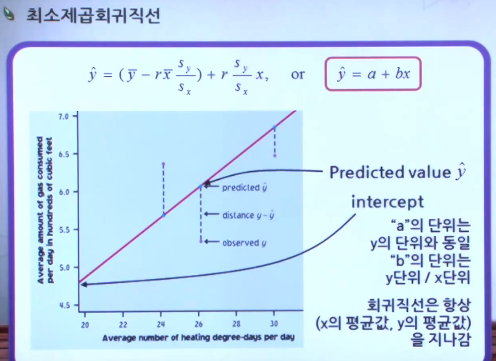
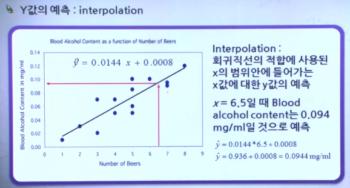
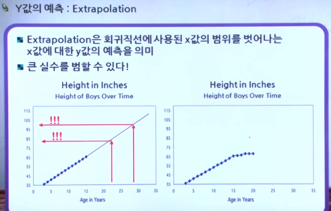
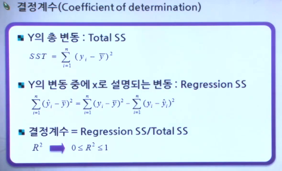
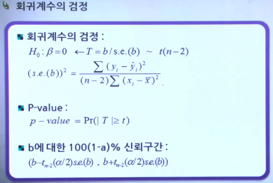
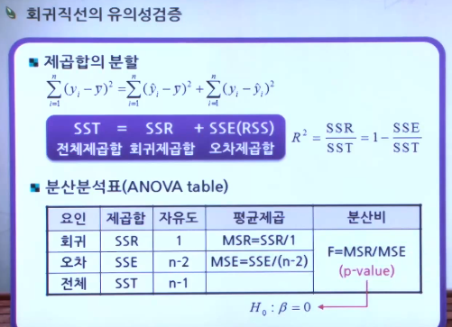
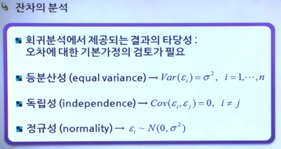
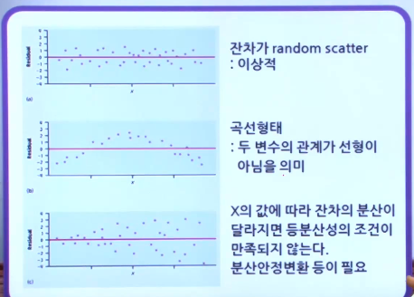

# 10강 - 단순선형회귀분석

1. 단순선형회귀분석..

   - 회귀분석이란, 변수들 간의 함수적인 관련성 규명을 위한 수학적 모형 가정 후 추정을 하는 통계적 분석방법이다.
   - 단순 선형 회귀분석(simple linear regression)은 반응(종속)변수 y와 하나의 설명(독립)변수 x와의 선형적 관련성을 규명하는 회귀분석이다.
   - 설명변수(또는 독립변수)는 흔히 X로 표현하며, 반응변수에 영향을 주는 변수이고, 반응변수(또는 종속변수)는 흔히  Y로 표현하며 어떤 실험이나 조사의 결과를 측정하는 변수이다.
   - 
   - 
   - 
   - 
   - 
     - Y의 변동 중에 x에 대한 회귀식으로 설명되는 변동의 퍼센트를 의미한다.
     - X와 Y의 선형관계의 강약을 나타냄
     - 단순선형회귀에서는 상관계수의 제곱과 정확히 일치
     - 결정계수가 0.22 라면 y의 변동 중 22%는 회귀모형으로 설명되고 나머지 78%는 모형에 포함하지 않은 다른 요인들로 설명된다는 뜻
   - 
   - 
   - 
   - 
   - 

