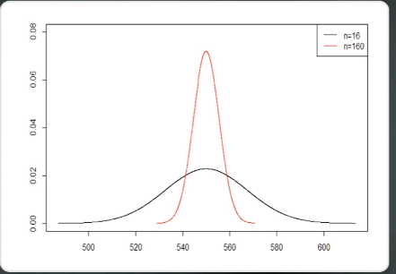

# 표본분포와 중심극한 정리 연습문제

1. 어느 도시 근로자의 수입은 평균이 250 만원이고, 표준편차는 50만원이라고 한다.

   1. 100명을 표본으로 선택하였을 때, 표본 평균의 분포는 무엇인가? (단위 : 만원, X : 도시 근로자의 수입)
      $$
      E(\bar{X}) = 250 \\
      σ(\bar{X}) = \frac{50}{\sqrt{100}} = 5 \\
      \bar{X} \text ~ N(250,5^2)
      $$

   2.  P (X > 260만원)은 얼마인가?
      $$
      P(\bar{X} > 260) = P(Z > \frac{260-250}{5}) = P(Z>2) = 0.0228
      $$

   

   

2. 모집단의 평균이 550 이고, 표준편차가 70일 때, 다음의 각 경우에 표본평균 X의 분포를 구하라

   1. 표본의 크기를 16으로 한다.
      $$
      E(\bar{X}) = 550 \\
      σ(\bar{X}) = \frac{70}{\sqrt{16}} = 17.5 \\
      \bar{X} \text{~} N(M,(\frac{σ}{\sqrt{n}})^2) = \bar{X} \text{~} N(550,17.5^2)
      $$
      

   2. 표본의 크기를 160으로 한다.
      $$
      E(\bar{X}) = 550 \\
      σ(\bar{X}) = \frac{70}{\sqrt{160}} = 5.53 \\
      \bar{X} \text{~} N(M,(\frac{σ}{\sqrt{n}})^2) = \bar{X} \text{~} N(550,5.53^2)
      $$
      

   

**표본의 개수가 많을 수록 표본 평균의 분산이 더욱 작아진다.**

