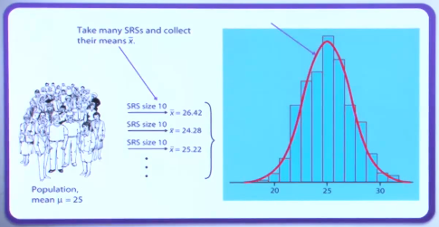
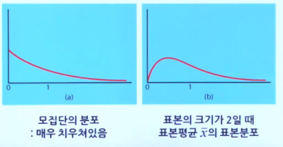
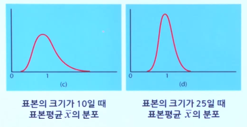

# 표본분포와 중심극한정리

### 모집단과 표본

 	1. 모집단 (population)
     - 어떤 연구에서 실제 관심있는 집단으로 흔히 전체를 연구하기 어려움
     - 예 : 모드 인간, 전국의 모든 근로자, 모든 금붕어
	2. 표본 (sample)
    * 모집단의 일부분으로서 실제로 연구자가 자료를 수집하여 연구하는 부분
    * 표본추출이 잘 되어야 연구전체가 의미 있어짐
	3. 모수 (parameter)
    * 모집단의 특성을 나타내는 숫자
    * 미지의 고정된 상수
    * 예 : 우리나라 남자 만 20세의 평균 키
	4. 통계량 (statistic)
    * 표본의 특성을 나타내는 숫자
    * 표본에 따라 다른 값을 갖는 확률변수
    * 모수를 추정하는 데에 사용됨
    * 예 : 랜덤1000명의 만 20세 남자를 뽑아내서 평균을 내는 것

###  표본분포(Sampling distribution)

1. 통계량의 표본분포

   * 이론적인 분포이고, 실제 관측하는 분포는 아님

2. 표본평균(X*)의 분포

   * 평균이 μ(`모수`)이고 표준편차가 σ인 모집단에서 표본크기 n인 표본을 많이 추출했다고 가정한다.
     이 때, 어떤 표본에서의 평균은 μ보다 크고, 어떤 표본에서의 평균은 μ보다 작아지면서 표본분포가 생선될 것이다.

   

3. 표본분포

   * 포본평균의 평균은 모집단의 평균과 같다.

     * μxbar = μ (불편추정량)

     * 표본평균의 표준편차는 모집단의 표준편차보다 작으며 표본의 크기가 증가함에 따라 
       $$
       \frac {1} {\sqrt{n}}
       $$
       의 비율로 줄어든다. 
       $$
       σxbar = \frac{σ}{\sqrt{n}}
       $$

   * 모집단이 정규분포를 따르면, 모든 표본 크기 n에 대해, 표본평균의 표본분포(sampling distribution)는 정규분포를 따른다.
     $$
     \text{모집단의 분포가 } N(μ, σ^2 ) \text{를 따르면, 표본 평균의 분포는 } N(μ,  \frac{σ^2}{n})\text{을 따른
     다.}
     $$

4. 적용 예

   1. Hypokalemia는 blood potassium level이 3.5eEq/dl 보다 낮을 때 관찰된다. 만약 어떤 환자의 blood potassium level이 μ=3.8이고 σ=0.2인 정규분포를 따른다고 알려져 있다면, **한 번**의 관측에서 이 환자가 hypokalemia로 진단될 확률은 얼마인가?

   $$
   z = \frac{(x-μ)}{σ} = \frac{3.5-3.8}{0.2}
   $$

   $$
   z = -1.5 , P( z<-1.5) = 0.0668 \approx 7\text
      $$

### 중심극한정리 (The central limit theorem)

평균이 μ이고 표준편차가 σ인 모집단에서 임의표본을 뽑을 때, 표본의 크기 n 이 크면 표본평균의 표본분포는 근사적으로 정규분포를 따르며, 그 평균은 μ이고, 표준편차는
$$
\frac{σ}{\sqrt{n}}
$$

**표본 크기가 커질 수록 표본평균은 작아진다. **

