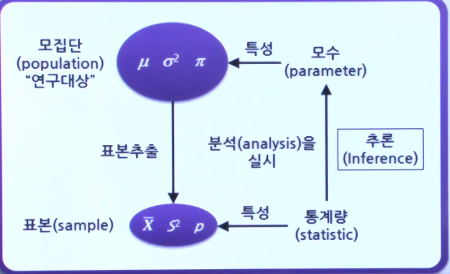
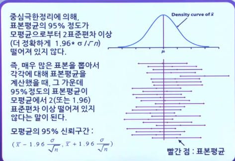
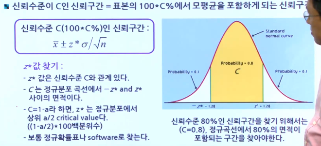

# 통계적 추론 (Statistical Inference)

### 통계적 추론

* 표본의 정보를 이용하여 실제로 관찰되지 않은 부분을 포함한 모집단 전체에 대한 추측

  

  * 모집단의 모평균, 모분산, 모비율을 알고 싶은데 이를 추정하기 위해 통계량의 표본평균, 분산,비율을 활용한다.

* 점 추정(Point Estimation) : 하나의 값으로 모수를 추정

* 구간추정(Interval Estimation) : 모수가 속하리라고 생각되는 적절한 구간을 설정하여 추정

### 점 추정

* 모평균을 추정하기 위해서 가장 많이 사용되는 통계량 = 표본평균
  $$
  \bar{x} = \sum_{i=1}^n x_i / n
  $$

* 모분산을 추정하는데 가장 많이 사용되는 통계량 = 표본분산
  $$
  S^2 = \sum_{i=1}^n (x_i-\bar{x})^2 / (n-1)
  $$
  

* 두 통계량의 특징 : 불편 추정량(unbiased estimator)
  $$
  E(\bar{X}) =  μ \\
  E(S^2) = σ^2
  $$

### 구간 추정

* 갈색 계란 하나의 무게가 평균이 65g이고 표준편차가 5g인 정규분포를 따른다고 하고, 12개의 계란이 들어있는 하나의 carton을 크기가 12인 표본이라고 하자
  표본 평균 x의 분포는 평균이 65g이고 표준편차가 1.44g(5/sqrt(12))인 정규분포이다. 이 분포의 중간 95%에 들어가는 계란들은 65+-2.82g의 무게를 갖는다.
  $$
  M = 65 \\
  σ = 5 \\
  n = 12 \\
  \bar{X} \text{ 의 SD} = \frac{5}{\sqrt{12}} = 1.44 \\
  65 \pm 1.96*1.44
  $$

* 이번에는 흰색 계란 12개가 들어있는 carton을 샀다고 하자. 전체 박스의 무게는 770g 이었다. 그렇다면 이 표본의 평균 x는 770/12 = 64.2g이 된다.
  흰색 계란의 무게의 표준편차도 5g이었다고 한다면, 이 표본을 근거로 흰색 계란 무게의 분포의 평균을 어떻게 추정할 수 있을까?
  $$
  64.2g \pm 2.82g
  $$

* 신뢰수준이 C인 신뢰구간

  