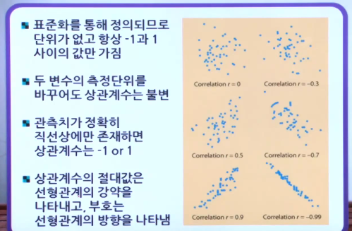

# 9강 - 상관분석

1. 상관분석(Correlation analysis)

   - 양의 상관(positive correlation) : 한 변수(X)의 값이 증가하면 다른 변수(Y)의 값도 증가한다.
     - 예 : 나이가 증가할 수록 혈압이 증가한다.
   - 음의 상관(negative correlation) : 한 변수(X)의 값이 증가하면 다른 변수(Y)의 값은 감소한다.
     - 예 : 나이가 증가할 수록 기억력이 감소한다.

   - 상관이 영(zero) : 두 변수 사이에 선형적인 관련이 없다.
   - 상관계수는 Pearson's correlation coefficient로 추정한다.
   - 
     - r : 피어슨 상관 계수
     - x, y : 변수의 평균과 값 을 의미
     - s : 변수에 대한 표준 편차 
   - 

   - 
   - 상관계수는 선형관계일 때 나타낼 수 있다. 곡선관계가 있는 경우에서는 변수변환을 통해 선형관계로 바꾼 후 상관계수를 계산해야 한다.

